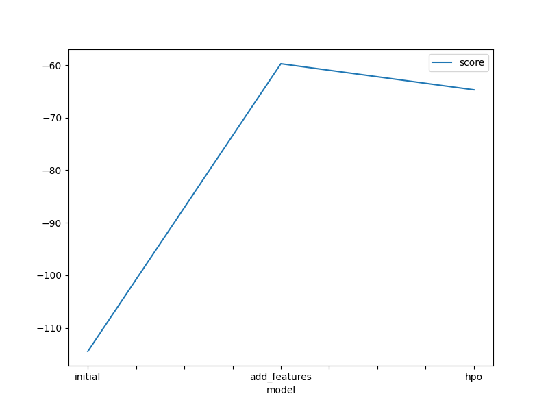
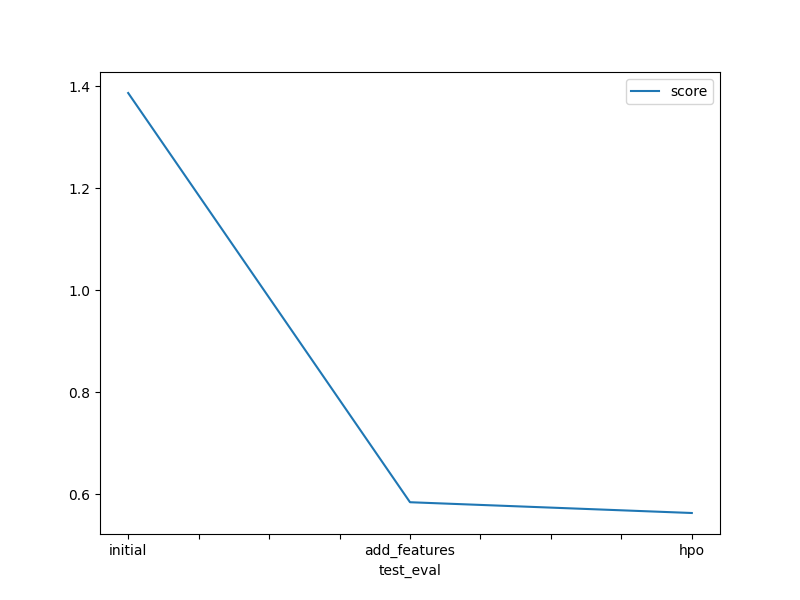

# Report: Predict Bike Sharing Demand with AutoGluon Solution
#### Rifat Perween

## Initial Training
### What did you realize when you tried to submit your predictions? What changes were needed to the output of the predictor to submit your results?
- Round negative count values to zero
- Round the numbers in count column to zero

### What was the top ranked model that performed?
WeightedEnsemble_L3 with hyper parameter optimized

## Exploratory data analysis and feature creation
### What did the exploratory analysis find and how did you add additional features?
- Time series analysis shows that:
    - There are data missing for last 10 days of the month. i.e; from 20th.
    - The changes in the demand of every hour during weekday and weekend.
- Correlation graph showed the high correlation between month and seasonality. So, removed seasonality from features.
- Categorzed continues features like temperature, humidity, wind etc.

### How much better did your model preform after adding additional features and why do you think that is?
After adding the additional feature, around 25% improvement found in the model score. Adding relevant features based on domain knowledge will result in more accurte predictions.

## Hyper parameter tuning
### How much better did your model preform after trying different hyper parameters?
A slight improvement in the kaggle score has been found after changing the hyper parameters.

### If you were given more time with this dataset, where do you think you would spend more time?
Will spend more time on future engineering and hyper parameter tuning as both are vital processess for building an efficient model.

### Create a table with the models you ran, the hyperparameters modified, and the kaggle score.
|model|hpo1|hpo2|hpo3|score|
|--|--|--|--|--|
|initial|default|default|default|1.85593|
|add_features|default|default|default|0.58493|
|hpo|CAT(iterations),RF(n_estimators), XT(n_estimators)|GB(num_boost_round, num_leaves)|scheduler, searcher|0.56334|

### Create a line plot showing the top model score for the three (or more) training runs during the project.

TODO: Replace the image below with your own.

### Create a line plot showing the top kaggle score for the three (or more) prediction submissions during the project.

TODO: Replace the image below with your own.

## Summary
In this project, we have obtained/explored following steps in the ML Lifecycle.

- Problem:
    Better utilization of the data generated by the systems in the bike sharing industry as well as exogenous information are keys to take business advantages for firms.
    
- Business Objective:
    Predict bike sharing demand provided data related to different factors provided.

- Obtain Data
    Data is obtained from the "Bike Sharing Demand" kaggle competition.
   
- Analyze Data
    Data is described, visualized and modified mainly using Pandas, Matplotlib and Seabon library.
   
- Build Model
    Built models using Autogluon AutomML library. Initially created model without any preprocessing. Later, built models creating new features and tuning hyper parameters.
    
- Test Model
    Models are tested by submitting the predictions to Kaggle and compared the models based on the scroe obtained. 
